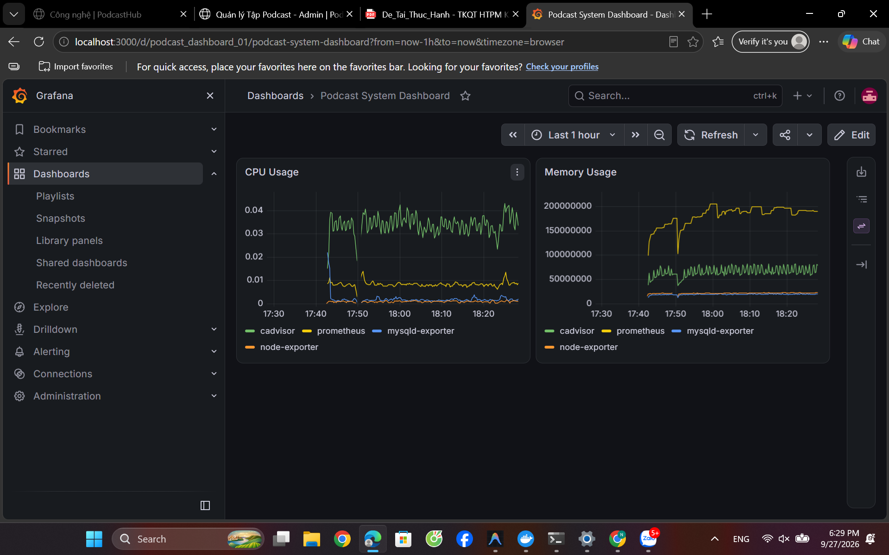

# Podcast Media Library - Đồ án Triển khai và Quản trị Hệ thống Phần mềm

Đây là dự án hệ thống Web Podcast/Media Library, được xây dựng và triển khai bằng Docker Compose, tích hợp đầy đủ hệ thống Monitoring (Prometheus, Grafana, cAdvisor, Node Exporter) và Logging (Loki, Promtail).

## 1. Kiến trúc hệ thống
Hệ thống bao gồm các thành phần (services) sau:
- **Ứng dụng chính**: 
  - `app`: PHP-FPM Backend xử lý logic.
  - `nginx`: Web Server & Reverse Proxy.
  - `mysql`: Cơ sở dữ liệu chính.
  - `phpmyadmin`: Giao diện quản trị Database.
- **Monitoring (Giám sát)**:
  - `prometheus`: Server thu thập và lưu trữ metrics.
  - `grafana`: Dashboard trực quan hóa metrics và logs.
  - `node-exporter`: Thu thập metrics của máy chủ (Host).
  - `cadvisor`: Thu thập metrics của các Docker containers.
  - `mysqld-exporter`: Thu thập metrics của MySQL.
- **Logging (Quản lý log)**:
  - `loki`: Hệ thống lưu trữ và truy vấn log tập trung.
  - `promtail`: Agent thu thập log từ các container và gửi về Loki.

## 2. Hướng dẫn cài đặt
### Bước 1: Clone mã nguồn
```bash
git clone <URL_CỦA_REPO>
cd <THƯ_MỤC_REPO>
```

### Bước 2: Cấu hình biến môi trường
Tạo file `.env` từ file mẫu `.env.example`:
```bash
cp .env.example .env
```
*(Sửa các giá trị mật khẩu trong file `.env` nếu cần thiết)*

### Bước 3: Khởi động hệ thống
Sử dụng Docker Compose để build và chạy tất cả các services ở chế độ background:
```bash
docker compose up -d --build
```

## 3. Danh sách Port và URL truy cập
Sau khi hệ thống khởi động thành công (các container ở trạng thái `Up`), bạn có thể truy cập qua các địa chỉ sau:

| Dịch vụ | Port (Host) | URL Truy cập | Ghi chú |
| :--- | :--- | :--- | :--- |
| **Web Podcast** | 8888 (HTTP) | `http://localhost:8888` | Sẽ tự động redirect sang HTTPS (8889) |
| **Web Podcast (SSL)** | 8889 (HTTPS)| `https://localhost:8889` | Chấp nhận cảnh báo chứng chỉ Self-signed |
| **phpMyAdmin** | N/A | `https://localhost:8889/phpmyadmin/` | Qua Nginx Proxy, đăng nhập: root / pass trong .env |
| **Grafana** | 3000 | `http://localhost:3000` | Tài khoản mặc định: `admin` / `admin` |
| **Prometheus** | (Không map) | Truy cập qua Grafana Datasource | Backend service |
| **Loki** | 3100 | Truy cập qua Grafana Explore | Cổng API 3100 |

## 4. Hướng dẫn xem Log tập trung
Hệ thống sử dụng **Loki** và **Promtail** để tự động thu thập toàn bộ log của các container (Nginx, PHP, MySQL...).
1. Đăng nhập vào Grafana (`http://localhost:3000`).
2. Ở thanh menu bên trái, chọn biểu tượng la bàn **Explore**.
3. Chọn Data source là **Loki** ở góc trên cùng bên trái.
4. Bấm vào **Log browser** để chọn container muốn xem log (vd: `container` = `/podcast-nginx`), hoặc nhập trực tiếp câu lệnh LogQL (tham khảo file `LOGQL_QUERIES.md`).

## 5. Yêu cầu 4: Tích hợp Prometheus + Grafana giám sát container
Dưới đây là kết quả cấu hình giám sát hệ thống và container trực quan thông qua Grafana (tích hợp Prometheus). Dashboard hiển thị thông tin tài nguyên theo thời gian thực:
- **CPU Usage**: Theo dõi tải CPU của các container (`cadvisor`, `prometheus`, `mysqld-exporter`, `node-exporter`...).
- **Memory Usage**: Theo dõi mức tiêu thụ RAM (bộ nhớ) tương ứng của từng container.


